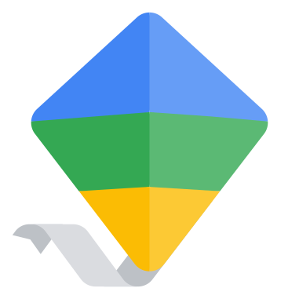

# 🕰️ Family Link: Screen Time Management for Kids 👨‍👩‍👧‍👦

[🇷🇺 Русская версия](README.md) | English Version

[](https://badge.fury.io/py/familylink)

An unofficial Python package for parental control and monitoring of children's screen time using Google Family Link.

<p align="center">
  
</p>

## 🌟 Key Features

- 📱 Manage screen time for multiple apps
- 🚫 Block specific applications
- ⏰ Set daily and weekly time limits
- 📊 Track app usage
- 🔒 Flexible configuration options

## 🚀 Installation

```bash
pip install familylink
```

## 📋 Usage via Command Line (CLI)

Create a `config.csv` file with the following format:

```csv
App,Max Duration,Days,Time Ranges
Calculator,,,                       # always allowed
Youtube,0:10,Mon-Fri,               # 10 minutes per day on weekdays
Youtube,0:30,Sat-Sun,               # 30 minutes per day on weekends
Fortnite,1:00,Wed,13:00-18:00       # 1 hour on Wednesday, between 13:00 and 18:00
Fortnite,1:00,Sat-Sun,09:30-18:00   # 1 hour on weekends, between 09:30 and 18:00
Google Photos,0:10,,                # 10 minutes every day
```

Apps not listed in the configuration will be blocked by default.

```bash
# Simulate changes without applying them
python -m familylink.cli config.csv --dry-run

# Apply changes using uv
uvx familylink config.csv --dry-run
```

## 🐍 Usage as a Library

### Create a Client

```python
from familylink import FamilyLink

client = FamilyLink()
```

### Set App Time Limit

```python
client.set_app_limit("Spotify", 30)  # Limit to 30 minutes
```

### Block an App

```python
client.block_app("Youtube")
```

### Always Allow an App

```python
client.always_allow_app("Calculator")
```

### Remove App Limit

```python
client.remove_app_limit("Youtube")
```

### View App Usage

```python
client.print_usage()
# ------------------------------
# Apps with Limits
# ------------------------------
# Spotify: Music and Podcasts: 30 minutes
#
# ------------------------------
# Blocked Apps
# ------------------------------
# YouTube
#
# ------------------------------
# Always Allowed Apps
# ------------------------------
# Calculator
#
# ------------------------------
# App Usage Today
# ------------------------------
# Spotify: Music and Podcasts: 00:30:09
```

## 🔒 Authentication Methods

- Browser Cookie Authentication
- Manual Login with Email and Password
- Secure Token Management

## 🤝 Contributing

Found a bug or want to improve the library? 
- Create an [issue](https://github.com/your-repository/issues)
- Send a pull request
- Share your feedback

## 📄 License

[Specify your license]

## 🛡️ Disclaimer

This is an unofficial tool and is not directly affiliated with Google. 
Use at your own discretion and responsibility.